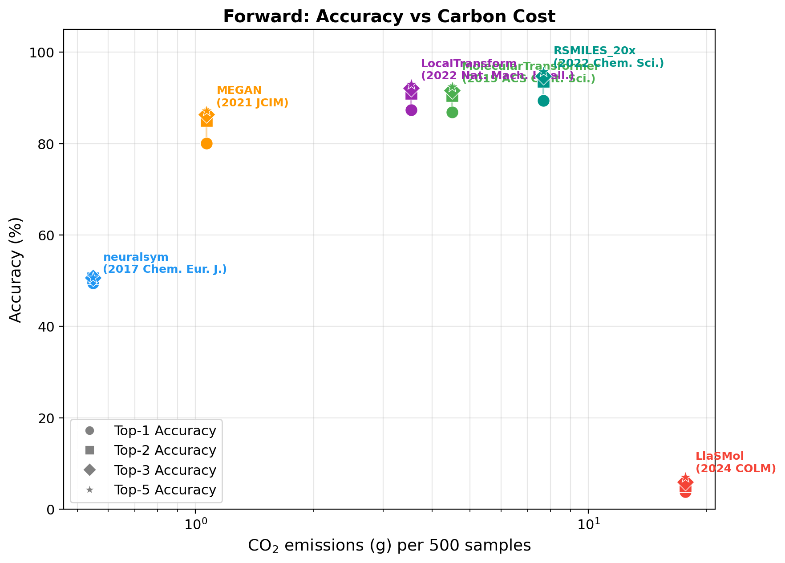

# Forward (Forward Reaction Prediction)

**Task Leader:** Shuan Chen

Forward reaction prediction: Given reactant molecules, predict the product(s) of the reaction.

## Metrics

| Metric | Description |
|--------|-------------|
| `top_1` | Exact match at rank 1 |
| `top_2` | Correct answer in top 2 predictions |
| `top_3` | Correct answer in top 3 predictions |
| `top_5` | Correct answer in top 5 predictions |

## Test Dataset

- **USPTO-MIT** (USPTO-480K): 40,029 test reactions
- Location: `data/test.csv`

## Models

| Model | Year | Venue | Architecture | Parameters | Environment |
|-------|------|-------|-------------|-----------|-------------|
| neuralsym | 2017 | Chem. Eur. J. | MLP (template) | 98.1M | `neuralsym` |
| MolecularTransformer | 2019 | ACS Cent. Sci. | Transformer (seq2seq) | 11.7M | `mol_transformer` |
| MEGAN | 2021 | JCIM | Graph Edit Network | 9.9M | `megan2` |
| LocalTransform | 2022 | Nat. Mach. Intell. | MPNN + attention | 9.1M | `rdenv` |
| RSMILES_20x | 2022 | Chem. Sci. | Transformer (seq2seq) | 44.6M | `rsmiles` |
| LlaSMol | 2024 | COLM | LLM (Mistral-7B + LoRA) | ~7.2B | `gpt` |

## Results

Full USPTO-MIT test set (40,029 samples, top_k=5). All models run on the same hardware.

*Hardware: NVIDIA RTX 5000 Ada (32GB), Intel Xeon Platinum 8558 (192 cores), 503 GB RAM*

### Accuracy (Top-k Exact Match)

| Model | Top-1 | Top-2 | Top-3 | Top-5 |
|-------|-------|-------|-------|-------|
| **RSMILES_20x** | **89.4%** | **93.6%** | **94.7%** | **95.8%** |
| LocalTransform | 87.4% | 91.0% | 92.1% | 93.0% |
| MolecularTransformer | 86.8% | 90.5% | 91.7% | 92.4% |
| MEGAN | 80.1% | 85.0% | 86.4% | 87.1% |
| neuralsym | 49.5% | 50.6% | 50.6% | 50.6% |
| LlaSMol | 3.8% | 5.1% | 5.9% | 7.1% |

### Carbon Efficiency

| Model | Duration (s) | Speed (s/mol) | Energy (Wh) | CO2 (g) | CO2 Intensity (g/s) |
|-------|-------------|---------------|-------------|---------|---------------------|
| neuralsym | 2,732 | 0.07 | 109.7 | 43.9 | 0.0161 |
| MEGAN | 6,657 | 0.17 | 213.3 | 85.3 | 0.0128 |
| MolecularTransformer | 12,317 | 0.31 | 899.9 | 360.0 | 0.0292 |
| LocalTransform | 17,799 | 0.44 | 707.2 | 282.9 | 0.0159 |
| RSMILES_20x | 46,209 | 1.16 | 1,536.8 | 614.7 | 0.0133 |
| LlaSMol | 104,960 | 2.62 | 3,534.6 | 1,413.8 | 0.0135 |

### Combined Results (per 500 samples)

| Model | Params | Top-1 | Top-5 | Time/500 (s) | Energy/500 (Wh) | CO2/500 (g) | Peak GPU (MB) |
|-------|--------|-------|-------|-------------|-----------------|-------------|---------------|
| RSMILES_20x | 44.6M | 89.4% | 95.8% | 578 | 19.2 | 7.7 | 2,849 |
| LocalTransform | 9.1M | 87.4% | 93.0% | 222 | 8.8 | 3.5 | 199 |
| MolecularTransformer | 11.7M | 86.8% | 92.4% | 154 | 11.2 | 4.5 | 76 |
| MEGAN | 9.9M | 80.1% | 87.1% | 83 | 2.7 | 1.1 | 152 |
| neuralsym | 98.1M | 49.5% | 50.6% | 34 | 1.4 | 0.5 | 1,508 |
| LlaSMol | ~7.2B | 3.8% | 7.1% | 1,312 | 44.2 | 17.7 | 16,247 |

### Accuracy vs Carbon Cost



### Key Observations

- **Best accuracy**: RSMILES_20x (89.4% top-1) — but at 615 g CO2 with 20x test-time augmentation
- **Best accuracy-efficiency tradeoff**: MEGAN (80.1% top-1 at only 85 g CO2, 1.1 g per 500 samples) — lowest CO2 intensity at 0.013 g/s
- **Seq2seq Transformers cluster together**: MolecularTransformer (86.8%) and LocalTransform (87.4%) are close in accuracy, with LocalTransform being more energy-efficient despite running longer
- **Template-based ceiling**: neuralsym is fastest (0.07 s/mol) but limited by template coverage (49.5% top-1)
- **LLM out-of-distribution**: LlaSMol (7B params) achieves only 3.8% on USPTO-MIT despite 63.3% on its training distribution — highest carbon cost (1,414 g) for lowest accuracy

## Usage

```python
from Forward.evaluate import load_test_data, evaluate, METRICS

# Load test data
test_cases = load_test_data(limit=100)

# Run model inference
from Forward.LocalTransform.Inference import run
predictions = [run(tc['product'], top_k=5) for tc in test_cases]

# Evaluate
results = evaluate(predictions, test_cases, metrics=['top_1', 'top_5'])
print(f"Top-1: {results['top_1']*100:.2f}%")
print(f"Top-5: {results['top_5']*100:.2f}%")
```
