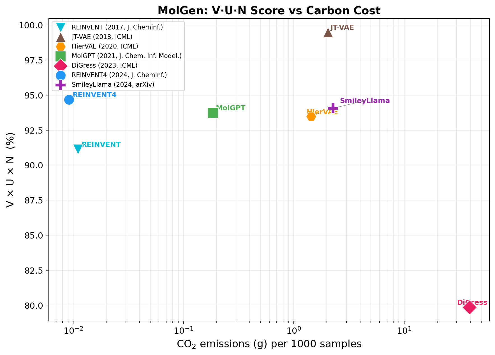
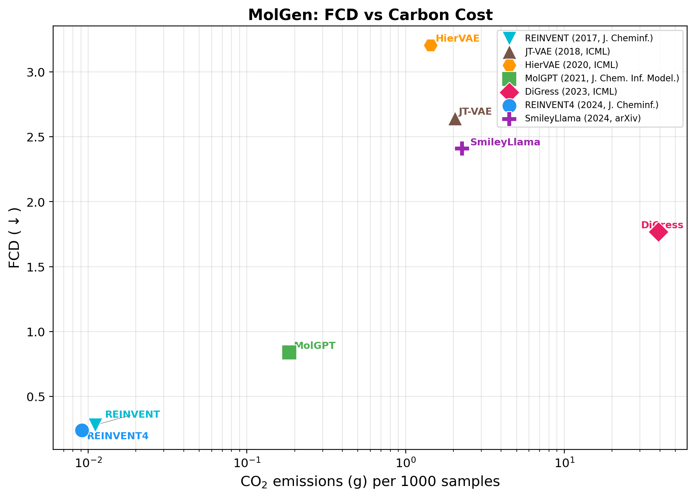
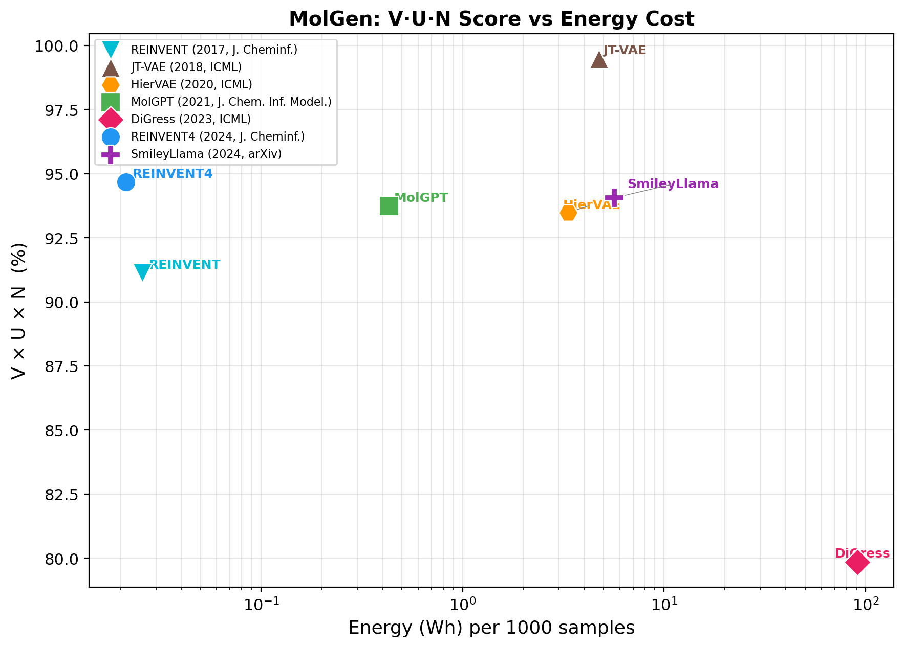
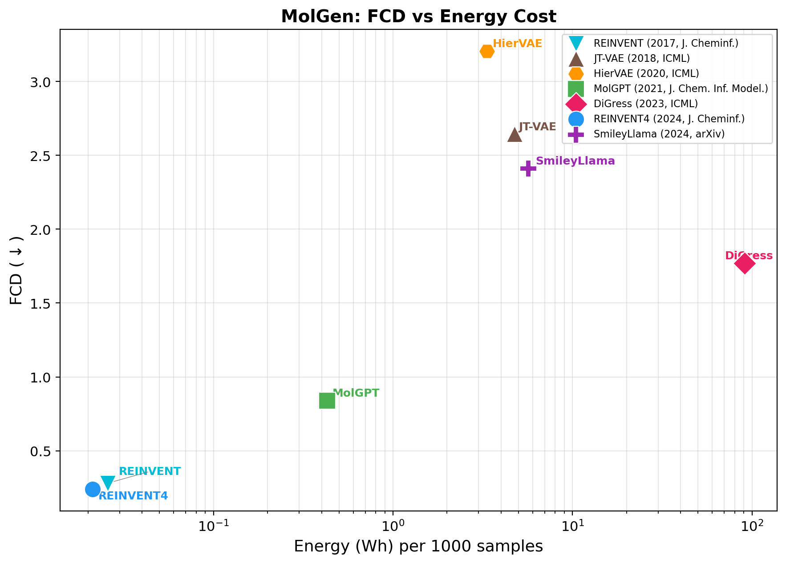
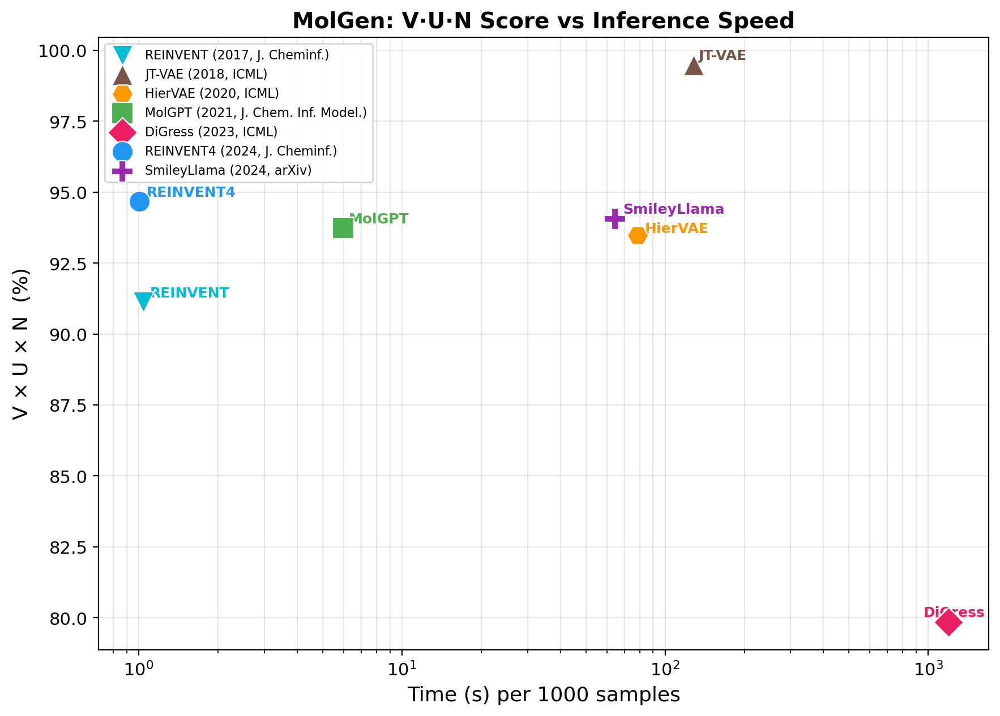
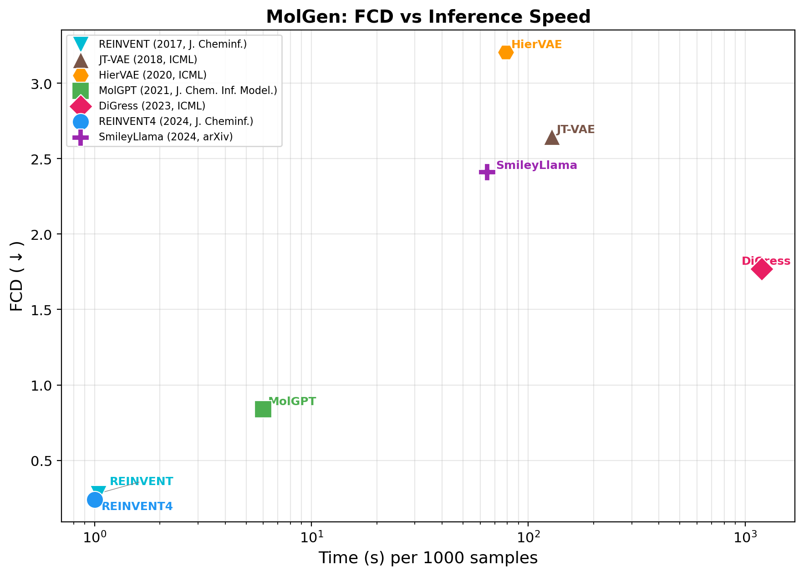
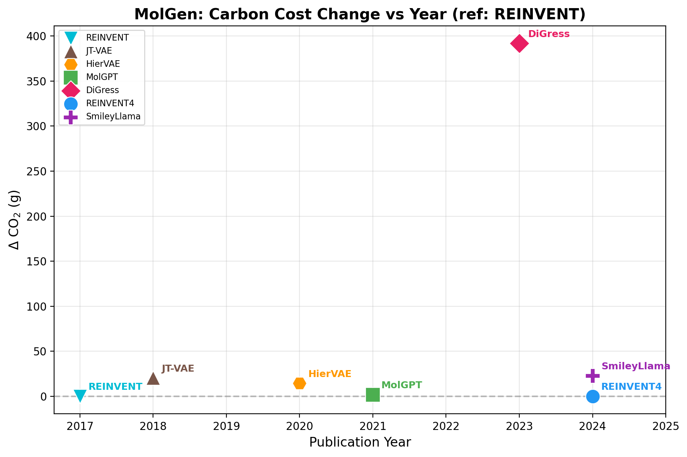
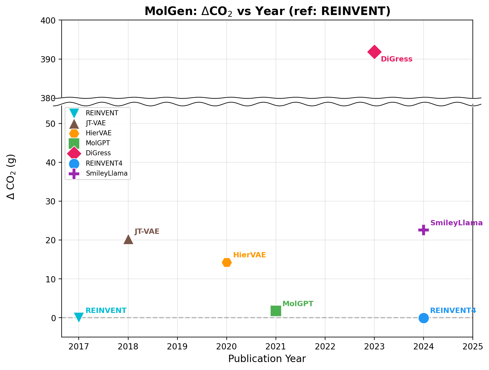
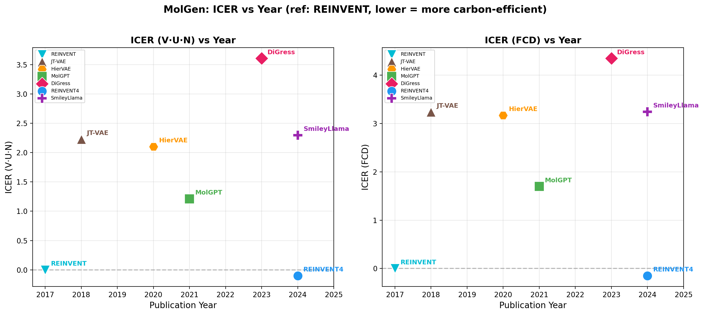

# MolGen (Molecule Generation)

**Task Leader:** Gunwook Nam

Molecular generation: Generate novel molecules from distribution.

## Metrics

| Metric | Description |
|--------|-------------|
| `V·U·N` | Validity × Uniqueness × Novelty (higher is better) |
| `FCD` | Fréchet ChemNet Distance between generated and train distributions (lower is better) |

- `validity`: Fraction of valid SMILES strings
- `uniqueness`: Fraction of unique molecules among valid ones
- `novelty`: Fraction of molecules not in training set

## Training Dataset

All models are trained on [ChEMBL 28](https://ftp.ebi.ac.uk/pub/databases/chembl/ChEMBLdb/releases/chembl_28/) (1.19M molecules, filtered).

- Location: `data/chembl28/{train,val,test}.txt`
- Split: 80/10/10, seed=42
- Filters: allowed atoms {C, N, O, S, F, Cl, Br}, MW ≤ 500, heavy atoms 3–50

## Models

| Model | Year | Venue | Params | Environment |
|-------|------|-------|--------|-------------|
| REINVENT | 2017 | J. Cheminf. | 4.4M | `carbon-reinvent` |
| JT-VAE | 2018 | ICML | 7.1M | `carbon-jtvae` |
| HierVAE | 2020 | ICML | 8.0M | `carbon-jtvae` |
| MolGPT | 2021 | J. Chem. Inf. Model. | 6.4M | `carbon-reinvent` |
| DiGress | 2023 | ICML | 16.2M | `carbon-digress` |
| REINVENT4 | 2024 | J. Cheminf. | 5.8M | `carbon-reinvent` |
| SmileyLlama | 2024 | arXiv | 8.0B | `carbon-smileyLlama` |
| DeFoG | 2024 | NeurIPS | TBD | `carbon-defog` |

## Results

### Benchmark (10,000 molecules)

| Model | Validity | Uniqueness | Novelty | V·U·N (%) | FCD ↓ | CO₂ (g) | Energy (Wh) | ICER (V·U·N) | ICER (FCD) |
|-------|----------|------------|---------|-----------|-------|---------|-------------|:------------:|:----------:|
| REINVENT (ref) | 0.9591 | 0.9996 | 0.9505 | 91.12 | 0.281 | 0.11 | 0.26 | 0 | 0 |
| JT-VAE | 1.0000 | 0.9984 | 0.9964 | 99.48 | 2.644 | 20.45 | 47.49 | +2.228 | +3.240 |
| HierVAE | 0.9853 | 0.9944 | 0.9541 | 93.48 | 3.205 | 14.39 | 33.42 | +2.102 | +3.171 |
| MolGPT | 0.9851 | 0.9992 | 0.9523 | 93.73 | 0.839 | 1.85 | 4.30 | +1.211 | +1.698 |
| DiGress | 0.8019 | 1.0000 | 0.9958 | 79.85 | 1.770 | 391.99 | 910.41 | +3.606 | +4.348 |
| **REINVENT4** | **0.9860** | **0.9997** | **0.9604** | **94.67** | **0.241** | **0.09** | **0.21** | **−0.100** | **−0.149** |
| SmileyLlama | 0.9427 | 0.9998 | 0.9980 | 94.06 | 2.410 | 22.67 | 56.68 | +2.297 | +3.244 |
| DeFoG | — | — | — | — | — | — | — | — | — |

**ICER** (Incremental Carbon-Effectiveness Ratio) = log10((ci/co) / (mi/mo)), where the reference (o) is REINVENT (2017). Lower is more carbon-efficient; negative means better performance with less carbon. For FCD (lower=better), mi/mo is inverted to FCDo/FCDi.

### Figures

#### Performance vs Carbon Cost

| V·U·N vs Carbon Cost | FCD vs Carbon Cost |
|:---------------------:|:------------------:|
|  |  |

#### Performance vs Energy Cost

| V·U·N vs Energy Cost | FCD vs Energy Cost |
|:--------------------:|:------------------:|
|  |  |

#### Performance vs Speed

| V·U·N vs Speed | FCD vs Speed |
|:--------------:|:------------:|
|  |  |

#### Carbon Efficiency Over Time

| ΔCO₂ vs Year (full scale) | ΔCO₂ vs Year (broken axis) |
|:--------------------------:|:--------------------------:|
|  |  |

| ICER vs Year |
|:------------:|
|  |
