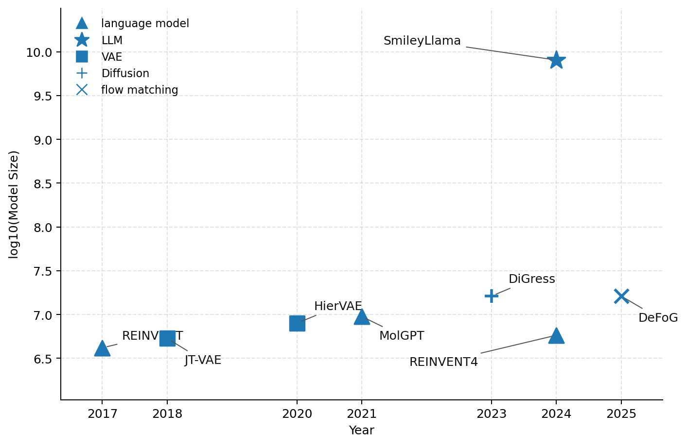
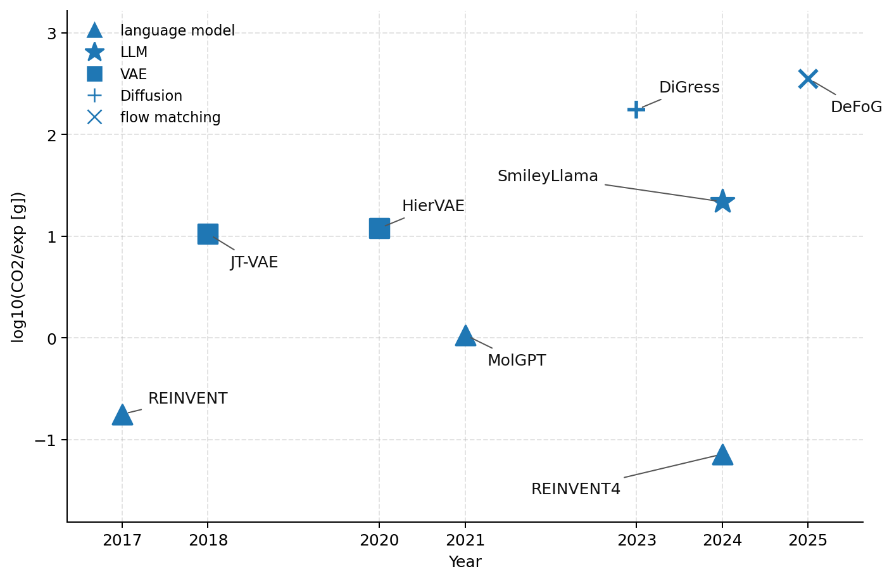
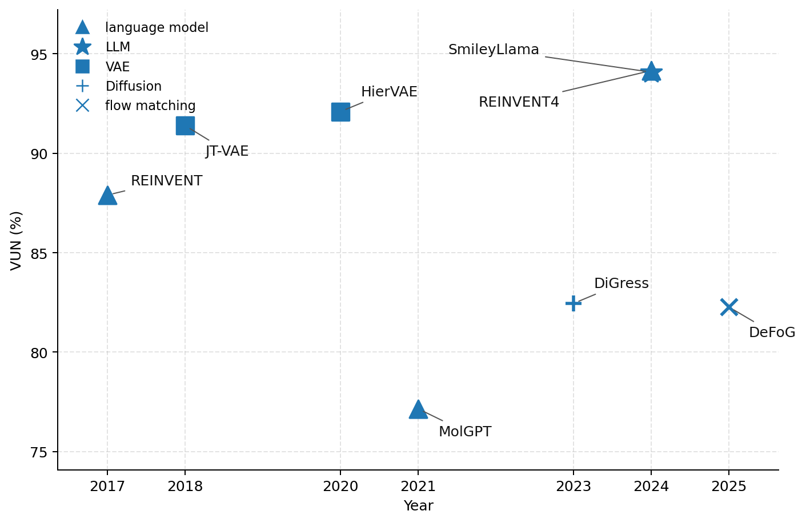
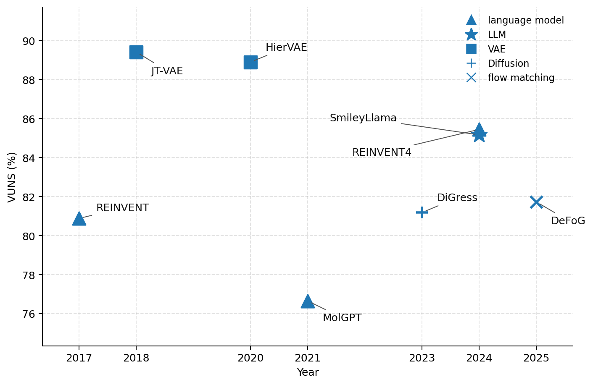
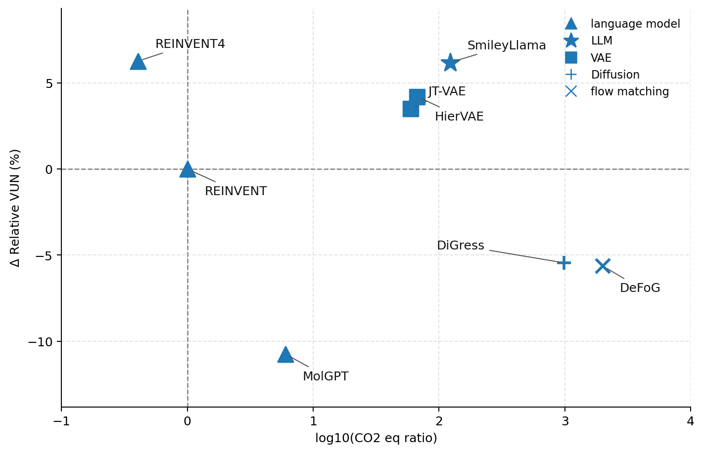
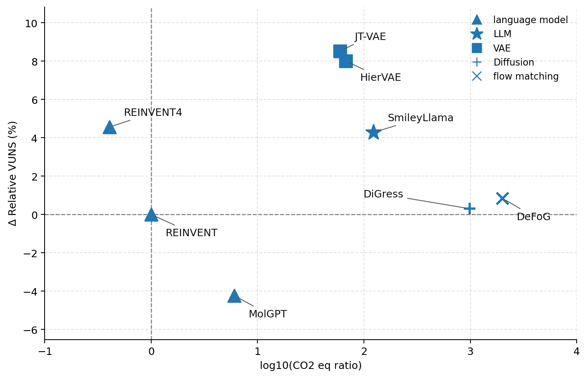

# MolGen (Molecule Generation)

**Task Leader:** Gunwook Nam

Molecular generation: Generate novel molecules from distribution.

## Metrics

| Metric | Definition |
|--------|------------|
| `VUN` | valid, unique, and novel molecules / generated molecules |
| `vSUN` | valid, unique, novel, and SA score `< 4` molecules / generated molecules |

- `validity`: valid SMILES / generated SMILES
- `uniqueness`: unique valid molecules / valid molecules
- `novelty`: unique valid molecules not in the reference set / unique valid molecules. It's computed against the model-specific novelty reference set. For released checkpoints, these references are not always official train splits, so they are called reference sets rather than uniformly calling them train sets.
- `sascore`: unique valid molecules with SA score `< 4` / unique valid molecules

## Models

| Model | Family | Year | Publish |
|-------|-----:|--------|-------------|
| REINVENT | LM | 2017 | [J. Cheminform.](https://jcheminf.biomedcentral.com/articles/10.1186/s13321-017-0235-x) |
| JT-VAE | VAE | 2018 | [ICML](https://proceedings.mlr.press/v80/jin18a) |
| HierVAE | VAE | 2020 | [ICML](https://proceedings.mlr.press/v119/jin20a.html) |
| MolGPT | LM | 2021 | [J. Chem. Inf. Model.](https://pubs.acs.org/doi/abs/10.1021/acs.jcim.1c00600) |
| DiGress | Diffusion | 2023 | [ICLR](https://iclr.cc/virtual/2023/poster/11556) |
| REINVENT4 | LM | 2024 | [J. Cheminform.](https://jcheminf.biomedcentral.com/articles/10.1186/s13321-024-00812-5) |
| SmileyLlama | LLM | 2024 | [arXiv](https://huggingface.co/papers/2409.02231) |
| DeFoG | FM | 2025 | [ICML](https://proceedings.mlr.press/v267/qin25d.html) |

LM: language model, LLM: large language model, FM: flow matching, VAE: variational autoencoder

## Results

| Model | Param. | Validity | Uniqueness | Novelty | SA<4 | VUN(%) | VUNS(%) | g CO2 eq/exp | Energy (Wh) |
|-------|-------:|---------:|-----------:|--------:|-----:|----:|-----:|-------------:|------------:|
| REINVENT | 4.2M | 94.4% | 100.0% | 93.2% | 91.9% | 87.9% | 80.9% | 0.2 | 0.4 |
| JT-VAE | 5.3M | 100.0% | 99.9% | 91.5% | 98.0% | 91.4% | 89.4% | 10.6 | 24.6 |
| HierVAE | 8.0M | 98.5% | 99.4% | 94.0% | 96.7% | 92.1% | 88.9% | 12.0 | 27.8 |
| MolGPT | 9.5M | 99.4% | 99.9% | 77.7% | 99.5% | 77.2% | 76.7% | 1.1 | 2.5 |
| DiGress | 16.2M | 87.6% | 100.0% | 94.2% | 98.6% | 82.5% | 81.2% | 175.4 | 407.3 |
| REINVENT4 | 5.8M | 98.1% | 100.0% | 96.0% | 91.0% | 94.2% | 85.4% | 0.1 | 0.2 |
| SmileyLlama | 8.0B | 94.6% | 100.0% | 99.5% | 90.6% | 94.1% | 85.2% | 21.8 | 54.5 |
| DeFoG | 16.3M | 91.5% | 100.0% | 89.9% | 99.4% | 82.3% | 81.7% | 355.2 | 888.1 |

## Novelty References

The count used for novelty is the canonical valid unique reference set size.

| Model | Reference source | count |
|-------|------------------|------:|
| REINVENT | filtered ChEMBL22 | 1,086,248 |
| JT-VAE  | MOSES | 1,584,663 |
| HierVAE | filtered ChEMBL | 1,799,433 |
| MolGPT | MOSES | 1,584,663 |
| DiGress | MOSES | 1,584,663 |
| REINVENT4 | ChEMBL25 | 1,606,456 |
| SmileyLlama | ChEMBL33 | 2,372,509 |
| DeFoG |MOSES | 1,584,663 |

## Figures

| Year vs Model Size | Year vs CO2/exp | Year vs VUN | Year vs VUNS |
|:------------------:|:---------------:|:-----------:|:------------:|
|  |  |  |  |

| Relative VUN vs CO2 ratio | Relative VUNS vs CO2 ratio |
|:--------------------------:|:---------------------------:|
|  |  |
